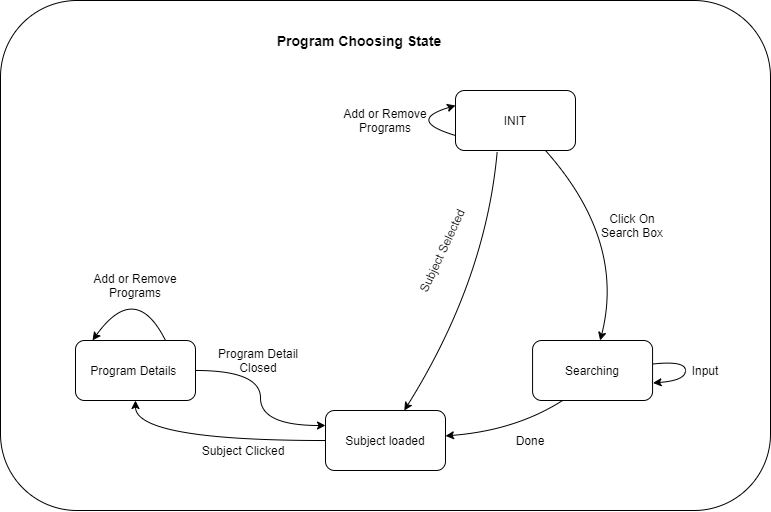

# Course Guide

## Vision
The Course Guide component helps students have a better understanding of what the right courses for them are.

The Course Guide generates a list of recommend courses based on the student's year and programs from students.

## Overview

The course guide covers the program and course selection of the user's journey through our system. 


### Program Selection

After a user selects their year, they're able to browse through the list of programs available to them, adding programs to their program cart as they see fit. 

__User Journey Statechart__


__Program Selection Concept Design__


### Course Selection

With the programs selected, the user now moves to the course selection stage. Here, the user can add courses to their course cart by exploring courses via the search bar or consulting our _Recommended Courses_ UI component's suggestions. 

__User Journey Statechart__
 

__Course Selection Concept Design__


## Component Breakdowns

The course guide involves the most UI interaction with the user, thus it is important to keep track of the abstract design. 

## Part 1: Program Choosing

### MyProgramsList

The list of programs the user has added. 

```js
MyProgramsList{
    data:{
        programs: //array of programs the user has added
    },
    methods:{
        deleteProgram(program) // triggered when pressing delete on a program
    },
    components:{
        ChosenProgramTile //each tile is a program in the list and is clickable
    }
}
```

### ChosenProgramTile

The component for the programs listed in My_programs_List

```js
ChosenProgramTile{
    data: {
        programName: String //The name of the program this tile represents
        subject //which subject this program belongs in
    },
    methods: {
        loadSubject(subject), /*displays the programs in the same subject as 
        selected_program in the "programCardsPanel",*/
        delete() //remove this program when the "x" button is clicked
    },
    components: {
        deleteButton
    }
}
```

### Subjects_List

The Subjects_List is a list of all the subject names offered at UTM. The user can browse through it and click a subject in this list to view all the programs of that subject.

```js
Subjects_List{
    data:{
        selectedSubject, //The selected subject needs to be highlighted
        searchMatchingSubjects: subject[] /*The subjects that have a program that 
                                            matches the search query*/
        showingGroups //array of groups that still shows in this list
    },
    components:{
        SubjectTiles: //an array of subject names that can be clicked
    }
}
```

### Subject_Tile

The component for the subjects in Subjects_List

```js
Subject_Tile{
    data: {
        subject, //the subject this tile represents
        highlighted: boolean
    },
    methods: {
        loadSubject(subject) /*displays the programs in the same subject as 
        selected_program in the "programCardsPanel",*/
    }
}
```

### programCardsPanel

The component that displays the detailed information of each program in a subject and allows the user to add a program to My_Programs_List

```js
programCardsPanel {
    data: {
        subject //The subject 
    },
    methods:{
        setSubject(subject) //Save the specified subject into data.subject to load programCards
    },
    components:{
        ProgramCards: //each individual program's information 
    }
}
```

### ProgramCard

The ProgramCard displays all the information about a specific program, and a button to add it

```js
ProgramCard {
    data:{
        program //The program this card represents
    },
    methods: {
        /*The required courses string for a certain year contains course codes
        that refer to a course, we need a regex to recognize the course code pattern and transform
        each of them into a CourseLink component that can be clicked to pop up a course info frame.*/
    },
    sub_components:{
        button, //The "Add" button
        courseLinks //each mention of a course code under required courses is a CourseLink
    }
}
```

### CourseLink

The course code of a course, clicking on it opens Course_Info_Pop_up

```js
CourseLink {
    data:{
        course //The course this component links to
    },
    methods: {
        openPopup() //Triggered when this component is clicked, create a new instance of the pop up frame
    }
}
```

### ProgramSearchBar

The user can search for a program by name

```js
ProgramSearchBar{
    data:{
        query: String, //The current search query
    },
    methods:{
        search(query) //Call search for query in back-end
    },
}
```

## Part 2: Course Choosing
