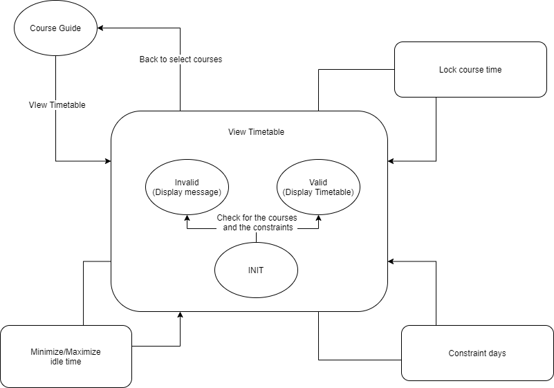
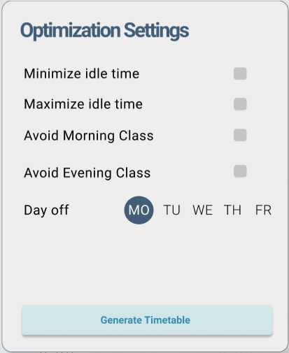
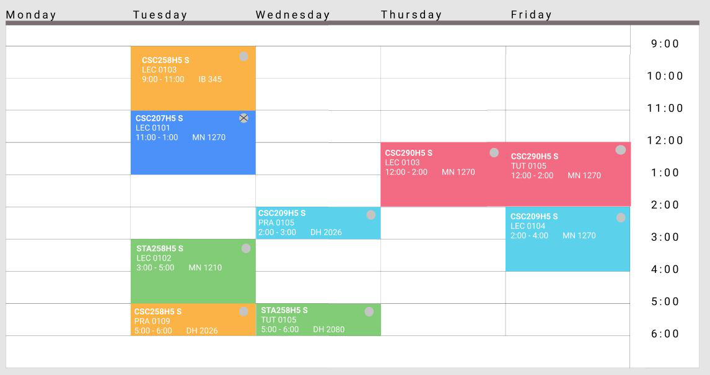

# Timetable Planner

A web app that helps UofT students plan their courses to generate their optimal timetable. 

The timetable planner allows students to enter their course load and get back a timetable that fits their needs. The vision for the timetable planner includes taking student preferences into account such as: 

- How early students wish to start and end classes
- What days students would like to take off
- What times students would prefer gap time and breaks


## Overview



Once the user selects the courses from the Course Guide:


The user views the timetable:

The timetable will display whether or not if the selected courses have a valid time, that is no conflict for all courses.

 - Valid:
 


 - Invalid:
 


There are serveral preferences that the user can select to optimize the timetable:




 - Minimize/Maximize idle time: The user can maximize or minimize the gap time between courses.
 - Days off: The user can select the day(s) off so there will be no course appear on that day.
 - Avoid Morning/Evening Class: The user can choose whether if they want to have courses in the morning or evening.
 
The timetable will return invalid and displays a message if the constraints are unreachable.


The user can also choose to lock certain course times. 

When preferences are made, those times will not be changed.


after a course is locked and a preference is being made:



## Roadmap for the Timetable Algorithm
<!---
- Introduce what the timetable algorithm is for
- Tell a story about how the algorithm evolves
- Have a heading for each optimization in the roadmap
- Start with base conflict check -> invalid times -> idle time max/min -> locked courses
--->
Timetable algorithm takes in a set of course names and transform into a list of timetables. Then the user can optimize the timetable to fit their preference.

The algorithm starts out basic, it checks if the sections given have conflict to each other. If there is no conflict, the algorithm will return "valid timetable", or if there is a conflict between any section, it will return "invalid timetable".

Based on the validity checking, the algorithm starts to be able to add constraints to the timetable.

The algorithm then takes in an invalid time argument that inputs from the user's preference time off. This argument is being treated like a course which will be parsed in to the timetable and check for conflict as well.

The algorithm then implements an idle time function which takes in a set of valid timetable and returns the max and the min idle time depend on the user's preference.

The algorithm then stores the user's locked courses in a list, with future optimization, the locked courses in the list will stays the same section.

### Checking for Conflicts

Before any optimization, the algorithm checks if it is possible to make a timetable out of the given courses by checking the conflict between the course times.

**Pseudocode**
```js
/**
 * 
 * @param timetable {DAY: [time_sections]}
 * @define time_section [start_time, end_time]
 */
function overlap(timetable){
    for day in timetable
        if the times of the day overlaps each other
            return false
    return true
}
```

### Time Offs

The user can input their desired time offs, such as day off or morning/evening off, the algorithm reruns the conflict check and returns valid timetable with the invalid times.

**Psedocode**
```js
function bucket_course_by_day(course_list, invalid_times){

    for course in course_list
        append to timetable
    for invalid_time_section in invalid_times
        append to timetable
    check if valid or not by overlap function

}
```


### Maximize or Minimize Idle Time

The user can choose to maximize or minimize their idle time at school, which is the time gaps between classes each day. The algorithm compares the total idle time in each timetable given and returns the user's preference.

**Pseudocode**

```js
function idleTime(set_timetable, max_or_min){

    for timetable in set_timetable
        sum up all the idle time and store the index
    check for the max and min of the idletimes
    return based on max_or_min

}
```

### Lock Sections

The user can lock the section(s) they prefer to stay the same while processing other optimizations. The algorithm stores the locked section in a list, when processing other optimization, the list is being compared and put in to the new timetable to ensure timetable includes the locked section.

<!---

Parse from course name to individual section

```js

This program takes in the input course data from example usage and produce a list of all combinations of the section times for the courses.

function courseToTime(course_lists){

    for course in course_lists
        for section in the course
            check if the enrolment is not full
                list of available courses appends the specific section of that course
    Make a combination out of all the courses from the list of available courses
    return the list of all possible combination

}
```
--->


